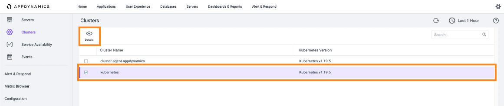
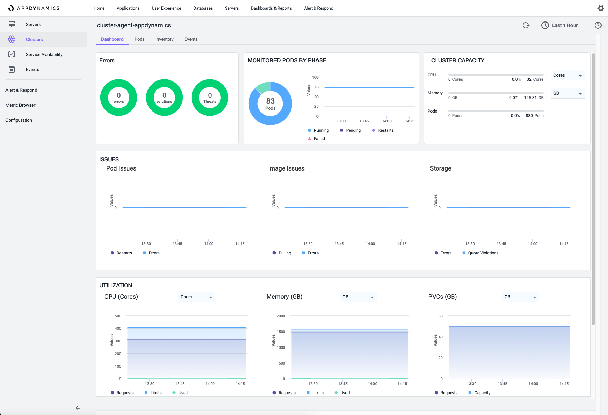

[](https://developer.cisco.com/codeexchange/github/repo/CiscoDevNet/terraform-appd-cluster-agent-install)

# Installing the Appdynamics cluster agent with Terraform
This repo contains shows how we can automation the installation of the AppDynamics `cluster-agent` on Kubernetes using Terraform.

## Requirements

You'll require the following to make this work in your environment:

- Kubernetes installed - we are using Intersight IKS (Intersight Kubernetes Service) Kubernetes deployed environment
- A Kubernetes `kubeconfig` file, ours is named `da-compute-kubeconfig.yml` but you can name yours with a name that makes the most sense for you but be sure to change the variable name in `terraform-appd-cluster-agent.tf`.
- Helm (we tested with version 3.8.2)
- Create your own `secret.tfvars` file with values set for variables mentioned in the lab further down in this README.md file
- Modify the variable `nsToMonitor` to ensure you are monitoring valid namespaces you would like to monitor with the Cluster Agent

## Credential values required in `secret.tfvar`

Terraform keeps sensitive values in a file named `secret.tfvar`and, because the values contain sensitive information such as account credentials, it's not posted here so you'll need to make one using your credentials. 

>
> Be sure to add `secret.tfvar` to your `*.gitignore` file to be sure you don't accidentally expose your credentials if you push your changes back to GitHub or other Git repository.

| Variable               | Description |
| -----------------------| ----------- |
| controller_url         | The URL of your AppDynamics Controller passed as a FQDN and port number. For example: https://example.saas.appdynamics.com:443 |
| controller_account     | The account name associated with you AppDynamics Controller.            |
| controller_username    | Your username associated with the AppDynamics Controller.               |
| controller_password    | The password of your username associated with the AppDynamics Controller                                                     |
| controller_accessKey   | The account access key for your AppDynamics Controller. **You may not need username and password if using accessKey.**                |

>
> Be sure to add `secret.tfvar` to your `*.gitignore` file to ensure you don't accidentally expose your credentials if you push your changes back to GitHub or other Git repository.


## Example `secret.tfvar` file
```
# AppDynamics controller credentials
controller_url       = "https://example.saas.appdynamics.com:443"
controller_account   = "acme"
controller_username  = "rockstar"
controller_password  = "myC00lpas$$W0rd"
controller_accessKey = "v12345b234"
```

## Creating and Applying the Terraform Plan

Here are the steps needed to run Terraform along with examples of each:

1. Initialize Terraform:

`terraform init  -var-file="secret.tfvars"`

2. Create a Terraform Plan:

`terraform plan -out terraform-appd-cluster-agent-install.tfplan -var-file='secret.tfvar' `

3. Apply the Terraform Plan:

`terraform apply -var-file='secret.tfvar'`

## Results

When you successfully apply the Terraform plan, you will see information about your Kubernetes clusters reported to the AppDynamics Controller by the Kubernetes Agent. To see the information, log into your AppDynamics Controller and navigate to the Servers Tab and clicking Clusters on the left-most navigation panel.



Then, select the your Kubernetes cluster followed by Details. This provides visibility into the metrics collected by your cluster and the namespaces defined in the variable named `nsToMonitor` in the `iks-cluster-2.yaml` file.



## Related Repos

Now that you are collecting metrics for your Kubernetes cluster used for the infrastructure hosting applications , check out how to integrate agents into applications with a hands-on sample.

[Cloud Native Sample Bookinfo App Observability](https://developer.cisco.com/codeexchange/github/repo/CiscoDevNet/bookinfo-cloudnative-sample)

You can also add monitoring of the host itself (the machines hosting Kubernetes in this case) by installing the AppDynamics machine Agent. Check out the Automation Exchange use case to learn more:

[Automated deployment of virtual machines and AppDynamics Machine Agent](https://developer.cisco.com/network-automation/detail/0eb959e6-bf39-11eb-81e3-1e23f581908f/)

## Related Sandbox

[Cisco AppDynamics sandbox](https://devnetsandbox.cisco.com/RM/Diagram/Index/9e056219-ab84-4741-9485-de3d3446caf2?diagramType=Topology)

## Links to DevNet Learning Labs

[AppDynamics Fundamentals](https://developer.cisco.com/learning/modules/appdynamics-fundamentals)

## Getting Support

Currently, Terraform AppD Cluster Agent Install is **Community Supported** only. If you have any challenges, you can create a new Issue in this repo's "Issues" area and hopefully a knowledgeable community member will reach back out to you with a resolution.
